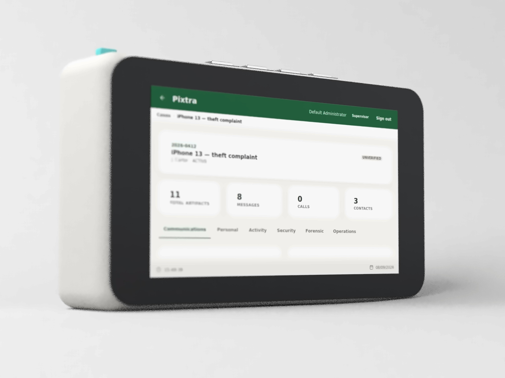

# Pixtra

**Portable iOS and Android mobile forensics triage station, built on a Raspberry Pi.**
Acquire, parse, analyse and report from a single offline handheld device.



---

## What it does

Pixtra turns a Raspberry Pi 5 with a 7" touch display into a self-contained triage kit for first-response mobile forensics. An examiner plugs a phone in, runs an acquisition from the touch screen, and can review the evidence and generate a report on the spot — no laptop, no cloud, no network.

**Acquisition**
- iOS logical acquisition via encrypted iTunes-style backup (`pymobiledevice3`), decrypted on-device
- Android logical acquisition over ADB
- checkm8 / checkra1n workflow for supported iPhones
- Import of existing backup folders
- SIM card reading through a USB CCID reader (ICCID, IMSI, carrier and last registered network)

**Parsing**
- iMessage / SMS, WhatsApp, contacts, call history
- Safari history, Wi-Fi networks, installed apps, keychain metadata
- Photos with EXIF and GPS, calendar, Wallet passes
- ChatGPT conversation history

**Analysis**
- Case dashboard with artifact counts by category
- Unified timeline across all sources
- Entity extraction and an interactive 3D relationship graph
- Locations map with stay-point detection, fully offline
- Search within messages and contacts

**Reporting and integrity**
- HTML case reports with selectable sections
- Chain-of-custody log for every action; SHA-256 hash manifest of every extracted file, re-verifiable on demand
- Role-based access: Viewer, Examiner, Supervisor
- Forced password change on first login, login lockout, session expiry

Everything runs on the device. Nothing is sent anywhere.

---

## Hardware

| Component | Notes |
|---|---|
| Raspberry Pi 5 | 4 GB or more |
| Raspberry Pi 7" Touch Display | 800 × 480 |
| microSD 32 GB+ | OS and application |
| USB storage | Case data (ext4 recommended) |
| USB CCID smart-card reader | Optional, for SIM cards |
| Lightning / USB-C cable | Device acquisition |

The case in the photos is 3D-printed; the STL is not part of this repository.

---

## Install

On a fresh Raspberry Pi OS (64-bit):

```bash
git clone https://github.com/lamaAlshuhail/Pixtra-Portable-iOS-Mobile-Forensics-Triaging-Station.git pixtra
cd pixtra
sudo ./setup-pixtra.sh
```

The script installs the system and Python dependencies, creates the `pixtra` systemd service pointing at the cloned folder, and adds the touch UI to the desktop autostart in full-screen mode. Case data goes to `/mnt/evidence/cases` by default; mount a USB drive at `/mnt/evidence` or set `PIXTRA_CASE_STORAGE` before running the script. If your display is mounted upside down, run it with `PIXTRA_ROTATE_DISPLAY=1`.

On first start the backend creates a Supervisor account named `admin` and prints its one-time password to the journal:

```bash
journalctl -u pixtra | grep "Initial password"
```

You are required to change it at first sign-in.

To choose the initial password yourself, set `PIXTRA_BOOTSTRAP_PASSWORD` in the service environment before the first start.

---

## Running from source

Backend (FastAPI):

```bash
cd pixtra-backend
pip install -r requirements.txt
pip install -r requirements-device.txt      # pymobiledevice3, iphone_backup_decrypt, pyscard
./run.sh                                     # http://127.0.0.1:8080
```

Touch UI (PyQt6, 800 × 480). Set `PIXTRA_KIOSK=1` to run it full-screen:

```bash
cd pixtra-qt
pip install -r requirements.txt
python3 main.py
```

A browser UI is also served by the backend at `http://127.0.0.1:8080`.

---

## Configuration

All settings are environment variables. Every one has a working default.

| Variable | Purpose | Default |
|---|---|---|
| `PIXTRA_DB_PATH` | Location of `pixtra.db` | `pixtra-backend/data/pixtra.db` |
| `PIXTRA_CASE_STORAGE` | Root folder for case data | `pixtra-backend/data/cases` |
| `PIXTRA_DECRYPT_DIR` | Scratch space for decrypted iOS backups | inside the acquisition folder |
| `PIXTRA_BOOTSTRAP_PASSWORD` | Initial admin password | random, printed once |
| `PIXTRA_BACKUP_PASSPHRASE` | Fixed iOS backup passphrase | random per device, stored per acquisition |
| `PIXTRA_ADB_PATH` | Path to `adb` | found on `PATH` |
| `PIXTRA_API_BASE` | Backend address used by the touch UI | `http://127.0.0.1:8080` |
| `PIXTRA_KIOSK` | Run the touch UI full-screen | unset |
| `PIXTRA_CHECKRA1N` | Path to the checkra1n binary | `~/checkra1n` |
| `PIXTRA_MAP_TILE_URL` | Basemap tile server for the Locations page | unset — markers on a plain background |
| `PIXTRA_MCC_MNC_FILE` | JSON file extending the carrier lookup table | unset |
| `PIXTRA_APP_CATALOG_FILE` | JSON file extending the installed-app catalog | unset |

Regional data — local carriers, local banking or government apps — is deliberately not shipped. Keep a private JSON file per deployment and point the two `*_FILE` variables at it:

```json
{"234-15": ["United Kingdom", "Vodafone"]}
{"com.example.bank": ["Example Bank", "Banking", "Example Bank Ltd"]}
```

---

## iOS backup encryption

Pixtra enables backup encryption on the handset before acquiring, because encrypted backups contain keychain material that plain backups do not. The passphrase is generated per device, stored on the acquisition record in `pixtra.db`, reused for later acquisitions of the same handset, and never written to the custody log or exposed through the API. `scripts/parse_keychain.py` reads it automatically.

If a handset already has backup encryption set with a different passphrase, either supply it with `PIXTRA_BACKUP_PASSPHRASE` or turn encryption off on the handset first:

```bash
python3 -m pymobiledevice3 backup2 encryption off <current-passphrase>
```

---

## Project layout

```
pixtra-backend/     FastAPI service: acquisition, parsing, analysis, reports, auth
  app/routers/      HTTP API
  app/services/     acquisition engine, parser engine, entity extraction, SIM reader
  scripts/          standalone parsers and backfill tools
  app/static/       browser UI (built bundle)
pixtra-qt/          PyQt6 touch interface for the 7" display
  pixtra/pages/     one module per screen
  pixtra/widgets/   shared components
  pixtra/assets/    vendored Leaflet and 3d-force-graph
setup-pixtra.sh     Raspberry Pi installer
```

---

## Security notes

- The backend binds to `127.0.0.1` only. Do not expose it to a network.
- Case data, databases and backups are excluded by `.gitignore`. Never commit `data/`.
- Evidence GPS coordinates are never sent to a tile server unless you configure `PIXTRA_MAP_TILE_URL` yourself.
- This tool performs logical acquisitions. It does not bypass device passcodes.

---

## Acknowledgements

Built on [pymobiledevice3](https://github.com/doronz88/pymobiledevice3), [iphone_backup_decrypt](https://github.com/jsharkey13/iphone_backup_decrypt), [pyscard](https://github.com/LudovicRousseau/pyscard), [checkra1n](https://checkra.in), FastAPI, PyQt6, Leaflet and 3d-force-graph.

## License

Apache License 2.0 — see [LICENSE](LICENSE).
